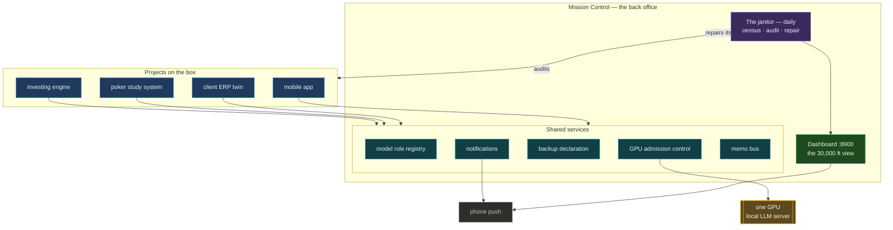
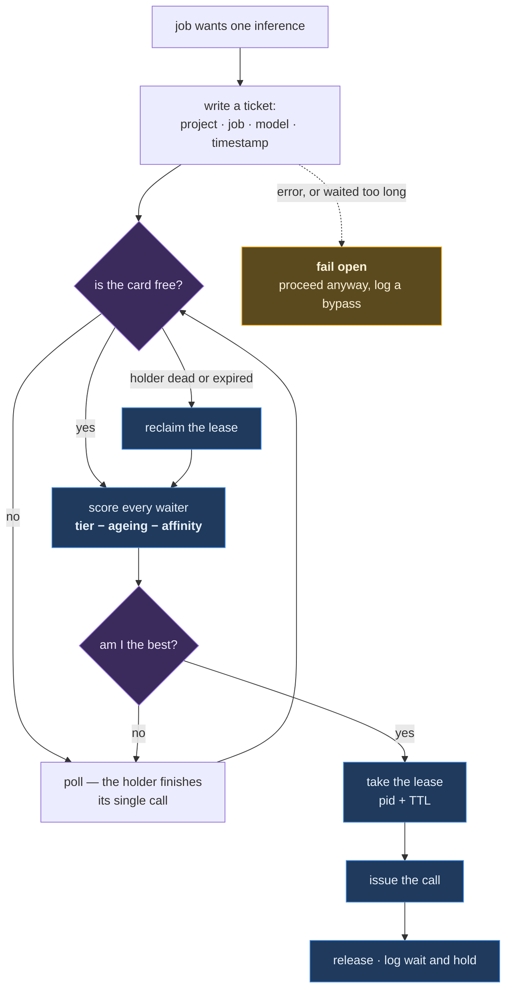
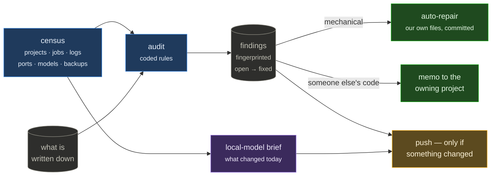
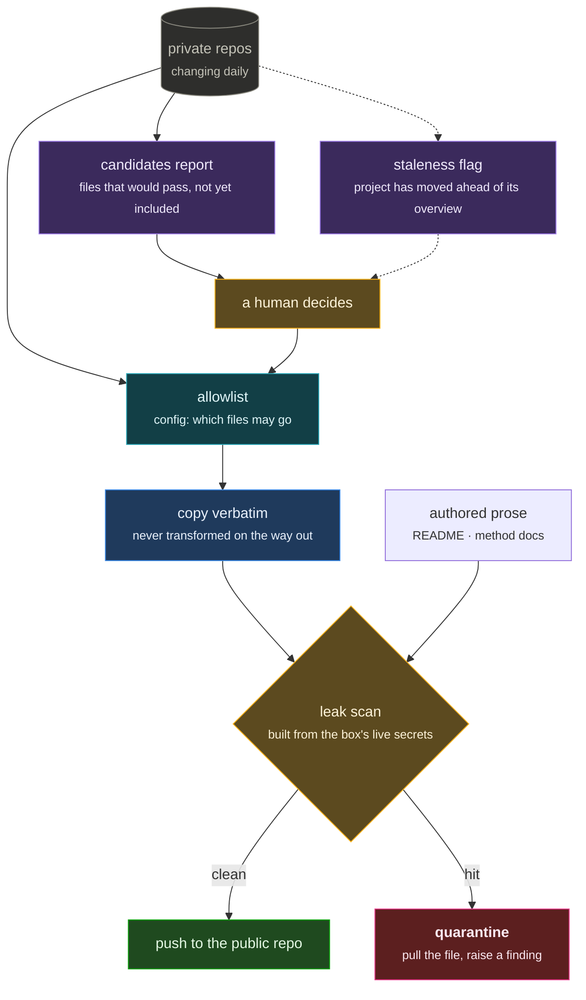

# Mission Control

A self-maintaining operations platform for a single-box AI workstation.

One machine runs several long-lived projects, dozens of scheduled jobs, a local LLM
serving every one of them, and multiple coding agents working concurrently. Mission
Control is the layer that makes that legible and keeps it honest — a dashboard, a set of
shared services the projects bind to, and a daily janitor that audits the box against its
own documentation and repairs what has drifted.

_Public overview of a private project. Architecture and selected components only._

## The problem it solves

Machine state — running jobs, listening ports, git activity, GPU usage — is easy to derive
live, so it never rots. The written layer rots constantly: the project roster, the job
registry, the ports table, "what's next" on each card. In practice it was maintained by
whoever remembered, and audited monthly. Drift had a 30-day half-life.

The measured state of the box on the day this was built: a project with 32 commits that
week had no entry in the dashboard at all, two nightly jobs were absent from the registry
that is supposed to document every job, and the roster's status text was four days stale.
None of that was a bug in any project. It was a written layer with no owner.



## Three faculties

**1 — The view.** One surface answering *what is this box doing, what changed, and what
needs me*: projects, jobs, agents, ports, notification history, token usage, and every
agent session that has run.

**2 — Shared services.** The things every project needs and none should own:

| Service | What it removes |
|---|---|
| Local-model **role registry** | No project names a model. Jobs ask for a role (`dense`, `bulk`, `embed`) and get the best model actually installed, after a pre-check that fails the job *before* it starts work if the box can't serve it. Upgrading the box's local models is one line of config; the preference list doubles as the fallback chain. |
| **GPU admission control** | One card, one call at a time, ordered by project priority instead of arrival time. See below. |
| **Notifications** | One channel per project, pushed through a shared helper that also keeps the permanent local history the push service doesn't. |
| **Memo bus** | Cross-project changes travel as memos with a status ledger, so one project never reaches into another's code. |
| **Backups** | One declaration of what is "gitignored and unrecoverable"; the writer, the watchdog's freshness alarm, and the audit all read it. |

**3 — The janitor.** A daily pass, costing no API tokens, that keeps 1 and 2 true.

## The GPU scheduler

The local model server serialises requests, but behind a FIFO queue — which is the wrong
order when a five-hour batch job, an hourly health sweep, and a market-hours pipeline all
share one card. Whoever's request arrived first won, and nothing could express "this one
matters more."

So the ordering decision is made *before* the request is issued, and exactly one call is
in flight at a time — which keeps the server's own queue empty by construction and makes
the local one authoritative. Priority is per project, with a few properties that matter
more than the ordering itself:

- **The unit is one call, not one job.** That makes preemption free: a batch of 800 reads
  releases between items, so a higher-priority job waits one call (~15 s) rather than five
  hours, and no generation is ever killed mid-flight.
- **Ageing, capped.** Strict priority alone starves the low tier all night. A waiter's
  score improves the longer it waits, bounded, so the worst case is minutes rather than
  never.
- **Model affinity, bounded below one tier gap.** Preferring a waiter that needs the
  already-resident model avoids reloading tens of gigabytes, but affinity can reorder
  within a tier and never across one.
- **Per-job ranks.** A long opportunistic batch can be ranked below its own project's
  interactive work while still outranking other projects.
- **It fails open.** Any internal error, or a wait past the timeout, lets the call through
  and records a bypass. A scheduler that can wedge the machine's AI is worse than none.
- **A dead holder cannot wedge it** — the lease carries a pid and a TTL, reclaimed by the
  next waiter.

Every caller asks for a slot; the queue decides who goes next:



Ordering is asserted by a self-test, because the ordering *is* the product:

```
$ gpu.py selftest
  ok  primary project beats housekeeping
  ok  interactive beats everything
  ok  ageing eventually beats a higher tier
  ok  ageing does NOT flip it early
  ok  affinity reorders within a tier
  ok  affinity does NOT cross a tier
  ...
  11/11 passed
```

The implementation is in [`code/gpu.py`](code/gpu.py); the role registry it resolves
against is [`code/models.py`](code/models.py).

## The daily janitor

```
census → audit → fix → memo → brief → push-if-changed
```

- **census** — every project on disk (git activity, uncommitted and unpushed work,
  required files, backup age), every scheduled job with its log and cadence, listening
  ports, model-role health.
- **audit** — coded rules diffing that census against everything written down: a project
  with no dashboard entry, a job missing from the registry (or a registry row with no
  job), a log that has gone quiet relative to its own cadence, an undeclared listening
  port, a missing backup declaration, a local-model call that skipped the GPU queue.
- **fix** — the mechanical class, in the platform's *own* files, then committed. It
  refuses to commit a file another agent session already had open, which matters on a box
  where several sessions run at once.
- **memo** — anything inside another project becomes a memo rather than an edit.
- **brief** — a local model reads each project's day of commits and writes two plain
  sentences for its card. It annotates; it never gates. Every finding above comes from a
  coded rule, so a model outage costs the narrative and nothing else.



Findings are fingerprinted and carry state (`open` → `fixed` / `resolved`), which is what
makes "new" a real event worth a notification, and lets an accepted deviation be muted
with a written reason instead of nagging forever.

Design rules the whole thing obeys:

1. **Derive, don't declare.** The roster is what's on disk. A check that needs a human to
   keep a list current is a check that will be wrong in a month.
2. **The local model never gates.** Rules produce findings; the model writes prose.
3. **Fix what we own, file what we don't.**
4. **Fail open, everywhere.** Nothing here may be able to stop the work it supervises.

## The code

Nine of the platform's components are in [`code/`](code/) — the scheduler, the model
registry, the janitor, the backup service and four of the local-model jobs. See
[`code/README.md`](code/README.md) for what each one demonstrates.

## Keeping the public mirrors honest

These public repos are themselves maintained by the platform, because a repo that
describes last month's system is worse for its purpose than no repo:



Three different things get three different treatments, which is the whole design:

| | How it stays current | Why |
|---|---|---|
| **Code** | re-copied verbatim and republished daily, automatically | it is mechanical, and the scanner is a real gate |
| **A file that starts leaking** | **quarantined** — pulled from the public repo, never published, raises a high-severity finding | private content can arrive in an already-published file long after anyone thought about publishing it. The daily scan is the tripwire, not the initial review |
| **New publishable code** | *proposed*, never auto-added | passing the scanner means a file carries no known secret. It does not mean the file is worth showing, and that is not a robot's call |
| **Prose** | never auto-written; flagged as stale once the project has moved far enough ahead | an authored description is the thing that cannot leak what it never contained |

Verified the way everything else here is: a real secret was planted in a published file
and the pipeline pulled it rather than pushing it.

## Stack

Python standard library only — no dependencies to rot — over cron, systemd, a local
model server, and git. The dashboard is a single-file HTTP server plus one HTML page,
mobile-first because it is mostly read from a phone. Roughly 4,000 lines.

_Last updated August 2026._
